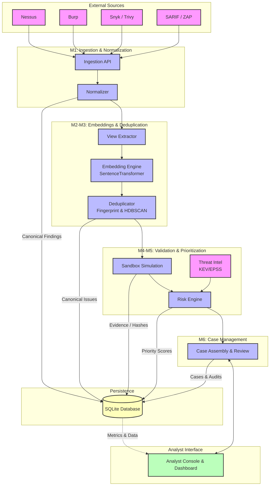

# AI-Assisted Triage Architecture

The following diagram illustrates the overall system architecture, data flow, and key modules of the AI-Assisted Triage (AI-Assisted Vulnerability Triage Platform).

## Key Components

1. **Ingestion & Normalization**: Standardizes raw findings from various scanners into a canonical format.
2. **Embeddings & Deduplication**: Extracts relevant text views, computes embeddings, and clusters duplicate findings into canonical issues.
3. **Validation**: Simulates exploits (offline) to validate vulnerabilities and stores immutable, hashed evidence.
4. **Prioritization**: Uses external threat intelligence (KEV, EPSS) alongside validation results to compute a weighted risk score.
5. **Case Management & Analyst Console**: Assembles prioritized issues into cases for human review via the dashboard.
