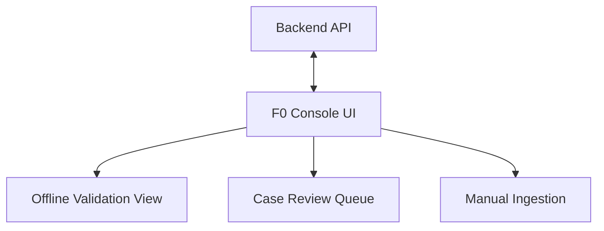

# F0 basic backend validation frontend

User-requested early frontend slice, independent of the unfinished P6/P7 modules.
Keep the existing FastAPI-served single HTML page; vanilla CSS/JS, no build step or CDN.

- Use current ingestion, finding/view/embedding, cluster, canonical issue and priority APIs.
- Provide JSON/SARIF upload, direct JSON and manual entry. Sample JSON comes from existing
  synthetic fixtures; filling an example never ingests it until the user submits.
- Show real counts from all paginated records, searchable findings/issues/cluster history,
  four-view text/status, embedding backend/dimension and risk contributions/explanations.
- Run core workflow means extract and embed findings, deduplicate, then prioritize active
  issues. Show stage progress and API failures; do not imply sandbox validation or case review.
- Expose existing merge/split actions and refresh invalidated priorities/issue membership.
- Prevent duplicate submissions, preserve useful errors, render scanner values as text,
  and keep the layout keyboard-accessible and responsive.
- Acceptance: browser checks against isolated local backend for empty/populated states,
  ingestion, workflow, details, split/merge, malformed input and narrow viewport; existing
  Python regression suite passes. This is not completion of all P8/P9 tasks.

## Architecture Diagram

