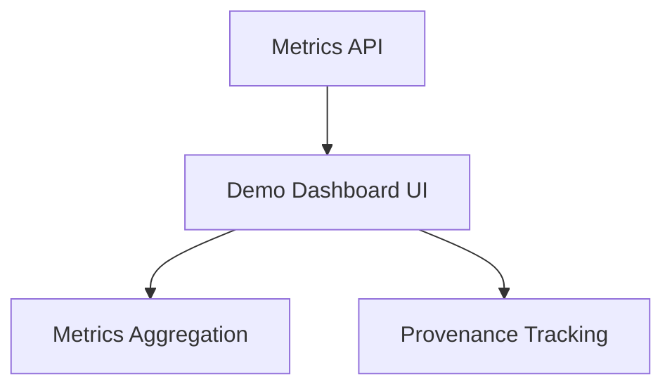

# F1 synthetic corpus demonstration dashboard

## Goal

Demonstrate the implemented pipeline from repository-owned scanner fixtures. The UI does not ask
an analyst to upload, paste or manually enter findings. It presents seven prepared exports,
including the repository's mixed workflow sample, loads them through a safe backend route, and
exposes the resulting evidence.

## Experience and contracts

- `GET /api/v1/demo/datasets` returns seven fixed metadata records totaling 116 findings: 110
  generated scanner fixtures plus the included six-record workflow sample.
- `POST /api/v1/demo/datasets/{id}/load` reads only the mapped file under `data/`; arbitrary paths
  and unknown IDs return 404.
- `GET /api/v1/dashboard/metrics` reports stored findings, active issues, clusters, priorities,
  validations and artifacts.
- The browser can load one export or all seven, run views, embeddings, deduplication and risk, then
  inspect findings, canonical issues, cluster reasons and risk contributions.
- An issue action runs the M5 offline simulator, retrieves redacted/hash-addressed evidence and
  recalculates risk. The UI labels simulation as supporting evidence rather than exploit proof.
- Use local HTML/CSS/JS with no build step or external asset dependency. Responsive layouts must
  retain every control and avoid horizontal page overflow.
- Follow root `design.md`: off-white canvas, warm ink, light serif display hierarchy, Inter-style
  body stack, pill actions, 16px cards, hairline borders, generous spacing and decorative pastel
  gradient orbs. Gradients remain atmospheric and never become action colors.

## Acceptance

Catalog count and fixed-path loading are tested; existing regression tests pass; JavaScript syntax
passes; rendered interaction is checked when the configured browser surface is available.

## Architecture Diagram

