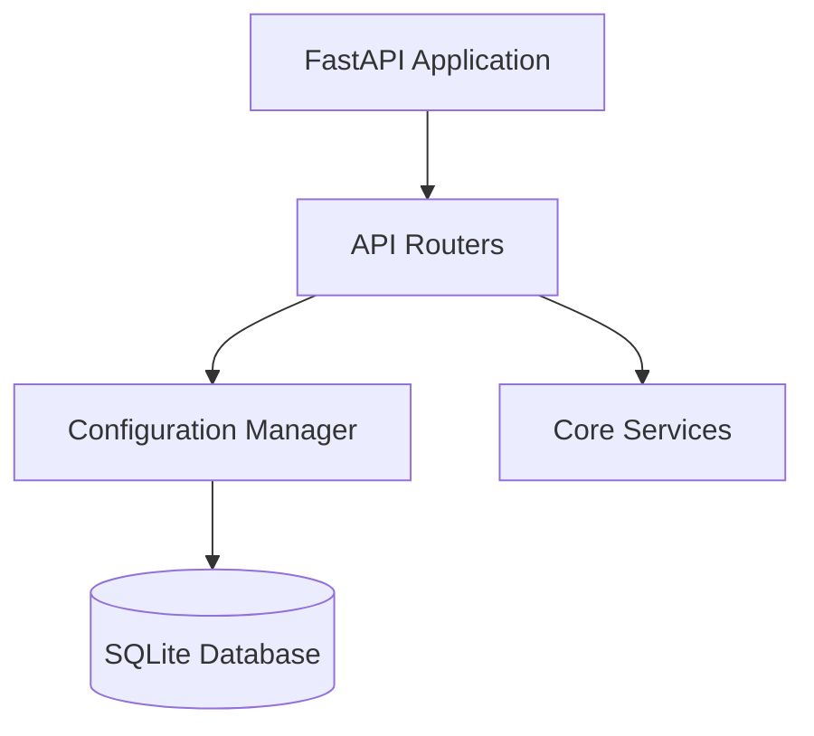

# Module 0 — Project Bootstrap

**Task IDs**: P0-01 through P0-07
**Estimated Time**: 30 minutes
**Must complete before**: All other modules

---

## Purpose

Module 0 creates the project skeleton — folder structure, dependency list, database tables, configuration, and the FastAPI application entry point. Every other module depends on these foundations existing and being correct.

An agent implementing this module does NOT write business logic. It creates the scaffolding that every other module hangs off of.

---

## What This Module Produces

After completing this module, the following must exist and be runnable:
- `requirements.txt` — all dependencies pinned
- `.env.example` — all config keys documented
- `src/app/config.py` — reads env vars, exposes a single settings object
- `src/app/database.py` — creates SQLite connection, defines all 13 tables
- `src/app/main.py` — FastAPI app that starts, initializes the DB, serves the static dashboard, and returns `{"status": "ok"}` from `/health`
- All empty `__init__.py` files and stub files so Python imports work
- `src/app/static/index.html` — placeholder "Dashboard loading..." page (replaced in Module 7)

---

## Required Dependencies

These are the only approved dependencies. Do not add others without team discussion.

| Package | Version | Purpose |
|---|---|---|
| `fastapi` | `0.115.*` | Web framework + automatic OpenAPI docs |
| `uvicorn[standard]` | `0.30.*` | ASGI server |
| `pydantic` | `2.*` | Data validation and schema enforcement |
| `sentence-transformers` | `3.*` | Text embedding for semantic deduplication |
| `scikit-learn` | `1.*` | HDBSCAN clustering + cosine similarity |
| `numpy` | `1.*` | Array operations for embedding math |
| `requests` | `2.*` | HTTP calls for EPSS and future integrations |
| `python-multipart` | `0.0.*` | Enables file uploads in FastAPI |
| `pytest` | `8.*` | Test runner |
| `httpx` | `0.27.*` | Async HTTP client used by FastAPI test client |

---

## Configuration Keys (`.env.example`)

Every key listed here must appear in `.env.example` with a comment explaining what it does. The `config.py` file reads all of these from environment variables.

| Key | Default | Description |
|---|---|---|
| `DATABASE_PATH` | `./ai-assisted-triage.db` | SQLite file location |
| `SANDBOX_ENABLED` | `false` | If true, runs real Docker PoC. If false, uses lab simulator |
| `SANDBOX_ALLOWLIST` | `app.example.test,target.lab` | Comma-separated allowed PoC target hosts |
| `SANDBOX_TIMEOUT_SECONDS` | `30` | Max seconds for any PoC execution |
| `MODEL_NAME` | `all-MiniLM-L6-v2` | SentenceTransformer model name |
| `KEV_LIVE` | `false` | If true, fetch KEV from CISA URL. If false, use local file |
| `KEV_DATA_PATH` | `./data/cisa_kev_mock.json` | Path to local KEV data file |
| `EPSS_LIVE` | `false` | If true, call EPSS API. If false, use local mock file |
| `EPSS_DATA_PATH` | `./data/epss_mock.json` | Path to local EPSS mock data |
| `EPSS_API_URL` | `https://api.first.org/data/v1/epss` | Live EPSS endpoint (used only when EPSS_LIVE=true) |
| `RISK_WEIGHT_CVSS` | `0.25` | Weight for CVSS component in risk score |
| `RISK_WEIGHT_EPSS` | `0.20` | Weight for EPSS component |
| `RISK_WEIGHT_KEV` | `0.15` | Weight for KEV flag |
| `RISK_WEIGHT_ASSET` | `0.15` | Weight for asset criticality |
| `RISK_WEIGHT_EXPOSURE` | `0.15` | Weight for network exposure |
| `RISK_WEIGHT_VALIDATION` | `0.10` | Weight for sandbox validation result |
| `SLACK_WEBHOOK_URL` | *(empty)* | Future: Slack notification webhook (stub only) |
| `JIRA_URL` | *(empty)* | Future: Jira base URL (stub only) |
| `JIRA_API_TOKEN` | *(empty)* | Future: Jira API token (stub only) |

> **Validation at startup**: `config.py` must verify that all RISK_WEIGHT values sum to exactly 1.0. If they do not, raise a `ValueError` with a clear message before the app starts.

---

## Database Tables

The `database.py` file must create all 13 tables using `CREATE TABLE IF NOT EXISTS` SQL. SQLite only — no ORM, no migrations framework for the prototype.

Every table must include: `id` (TEXT PRIMARY KEY, UUID), `created_at` (TEXT, ISO 8601), `updated_at` (TEXT, ISO 8601).

### Table Definitions (Conceptual — not code)

**`scanner_findings`**
- Purpose: Stores the raw, unmodified finding exactly as received from the scanner (or manual entry form). This is immutable after insert.
- Key fields: `finding_id`, `source_scanner` (nessus/burp/snyk/trivy/sarif/manual), `source_finding_id` (scanner's own ID), `ingestion_batch_id`, `raw_data` (TEXT, JSON string of original record), `raw_data_hash` (SHA-256 of raw_data), `ingested_at`, `status` (received/processing/normalized/rejected)

**`normalized_findings`**
- Purpose: Canonical normalized version of each finding. One-to-one with scanner_findings.
- Key fields: `finding_id` (FK to scanner_findings), `fingerprint` (SHA-256 string, indexed), `normalization_status` (normalized/normalized_with_warnings/rejected), `completeness_score` (REAL 0.0-1.0), `normalized_data` (TEXT, full JSON of NormalizedFinding schema), `normalization_warnings` (TEXT, JSON array of warning strings)

**`finding_views`**
- Purpose: Four extracted views per finding (one row per view per finding).
- Key fields: `finding_id` (FK), `view_type` (description/location/reproduction/impact), `view_text` (TEXT, embedding-ready text after redaction), `view_structured` (TEXT, JSON of structured sub-fields), `view_status` (available/partial/inferred/missing/conflicting), `confidence` (REAL), `extraction_method` (TEXT), `source_fields` (TEXT, JSON array)

**`finding_embeddings`**
- Purpose: Vector embeddings per view. Stored as JSON arrays.
- Key fields: `finding_id` (FK), `view_type`, `embedding_vector` (TEXT, JSON float array), `model_name`, `model_version`, `embedding_dimension` (INTEGER), `input_text_hash`, `generated_at`

**`clusters`**
- Purpose: Groups of likely-duplicate findings identified by the deduplication engine.
- Key fields: `cluster_id`, `cluster_method` (fingerprint/semantic/manual), `status` (candidate/merged/kept_separate/rejected_merge), `similarity_score` (REAL), `merge_reason` (TEXT, JSON array), `merge_confidence` (REAL), `hdbscan_params` (TEXT, JSON), `run_at`

**`cluster_members`**
- Purpose: Junction table linking findings to clusters (many-to-many).
- Key fields: `cluster_id` (FK), `finding_id` (FK), `role` (primary/secondary), `joined_at`

**`canonical_issues`**
- Purpose: The merged, deduplicated issue representing one or more source findings.
- Key fields: `canonical_issue_id`, `title`, `cluster_id` (FK, nullable), `source_finding_ids` (TEXT, JSON array), `source_scanners` (TEXT, JSON array), `merge_method`, `merge_confidence`, `review_status` (pending/merged/kept_separate/rejected_merge)

**`validation_runs`**
- Purpose: Records each sandbox/simulator execution attempt.
- Key fields: `validation_id`, `canonical_issue_id` (FK), `finding_id` (FK), `status` (confirmed_exploitable/not_exploitable/inconclusive/not_attempted), `confidence` (REAL), `sandbox_mode` (lab_simulator/docker/skipped), `execution_summary`, `executed_at`, `timeout_seconds`

**`artifacts`**
- Purpose: Immutable evidence artifacts from ingestion, extraction, and validation.
- Key fields: `artifact_id`, `entity_type` (finding/validation/case), `entity_id` (FK to respective table), `artifact_type` (scanner_record/http_request/http_response/poc_script/container_log/validation_summary), `content` (TEXT, inline for <10KB), `content_hash` (SHA-256), `content_size` (INTEGER bytes), `redacted` (INTEGER 0/1), `metadata` (TEXT, JSON of extra context)

**`threat_intelligence`**
- Purpose: Cached KEV and EPSS data per CVE. Cache avoids repeated API calls.
- Key fields: `cve_id` (TEXT PRIMARY KEY), `kev_flag` (INTEGER 0/1), `kev_date_added` (TEXT), `epss_score` (REAL), `epss_percentile` (REAL), `fetched_at`, `data_source` (mock/live)

**`priorities`**
- Purpose: Risk scoring output for each canonical issue.
- Key fields: `priority_id`, `canonical_issue_id` (FK UNIQUE — one priority per issue), `risk_score` (REAL 0-100), `remediation_tier` (Immediate/Accelerated/Standard), `factors` (TEXT, JSON of all input values), `weights_used` (TEXT, JSON), `explanation` (TEXT, JSON array of strings), `calculation_version`

**`cases`**
- Purpose: Analyst-ready case documents assembled from all pipeline stages.
- Key fields: `case_id`, `canonical_issue_id` (FK UNIQUE), `status` (pending_review/approved/rejected/more_evidence_requested), `title`, `summary`, `case_data` (TEXT, full JSON of Case schema), `created_at`, `last_updated_at`

**`reviews`**
- Purpose: Every analyst action on a case. Append-only.
- Key fields: `review_id`, `case_id` (FK), `action` (approved/rejected/requested_evidence/priority_override/merge_split/commented), `actor_id` (TEXT, analyst identifier), `comment` (TEXT), `reason` (TEXT, required for reject/override), `previous_status`, `new_status`, `reviewed_at`

**`audit_events`**
- Purpose: Immutable log of all system state changes across all entities.
- Key fields: `event_id`, `entity_type` (finding/cluster/canonical_issue/validation/case/review), `entity_id`, `action` (TEXT), `actor` (system/analyst-id), `details` (TEXT, JSON), `occurred_at`

---

## FastAPI App Structure (`main.py`)

The main.py file must:
1. Create the FastAPI application instance with title, description, and version metadata.
2. On startup (lifespan event): call `init_db()` from `database.py`.
3. Register all API routers from `api/` with their prefixes:
   - `api/ingestion.py` → prefix `/api/v1`
   - `api/findings.py` → prefix `/api/v1`
   - `api/clusters.py` → prefix `/api/v1`
   - `api/validation.py` → prefix `/api/v1`
   - `api/cases.py` → prefix `/api/v1`
   - `api/dashboard.py` → prefix `/api/v1`
4. Serve `src/app/static/index.html` at the root path `/`.
5. Expose a `/health` endpoint returning `{"status": "ok", "version": "0.1.0"}`.

---

## Stub Files Required

The following files must exist (even as empty stubs with just a docstring) before any other module can import from them. The implementing agent must create all of these:

- `src/app/schemas/__init__.py`
- `src/app/schemas/canonical.py` (stub — filled by Module 1)
- `src/app/schemas/views.py` (stub — filled by Module 3)
- `src/app/schemas/dedup.py` (stub — filled by Module 4)
- `src/app/schemas/validation.py` (stub — filled by Module 6)
- `src/app/schemas/risk.py` (stub — filled by Module 5)
- `src/app/schemas/case.py` (stub — filled by Module 7)
- `src/app/parsers/__init__.py`
- `src/app/parsers/base.py` (stub — filled by Module 1)
- `src/app/services/__init__.py`
- `src/app/repositories/__init__.py`
- `src/app/repositories/findings_repo.py` (stub — filled progressively)
- `src/app/api/__init__.py`
- All `api/*.py` stubs returning `{"status": "not_implemented"}` from each route

---

## Verification (How to Know Module 0 Is Done)

Run `python -m uvicorn src.app.main:app --reload --port 8000`.

Expected results:
- No import errors on startup
- `GET http://localhost:8000/health` returns `{"status": "ok", "version": "0.1.0"}`
- `GET http://localhost:8000/` returns the placeholder dashboard HTML page
- `GET http://localhost:8000/docs` shows the FastAPI OpenAPI UI with all routes listed (even if they return 501)
- The SQLite file at `DATABASE_PATH` is created on disk with all 13 tables (verify with `sqlite3 ai-assisted-triage.db .tables`)

## Architecture Diagram

