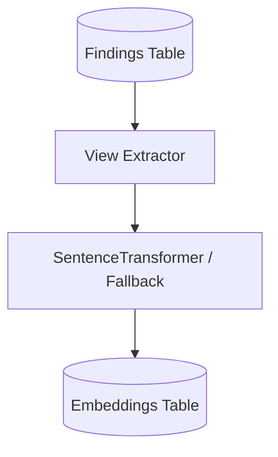

# Module 2 — Multi-View Extraction & Embeddings

**Task IDs**: M2-01 through M2-10
**Estimated Time**: 60 minutes
**Depends on**: Module 1 complete — normalized_findings table must be populated
**Produces**: `finding_views` and `finding_embeddings` table rows for every normalized finding

---

## Purpose

After normalization, each finding is a single data blob. This module **splits every finding into 4 structurally distinct views** that capture different dimensions of the vulnerability:

1. **Description** — *What* the vulnerability is (class, title, CWE, CVE context)
2. **Location** — *Where* it exists (host, path, parameter, package, file)
3. **Reproduction** — *How* it was observed (request, response, payload, steps)
4. **Impact** — *What* an attacker could do (inferred from CWE, CVSS, keywords)

These views serve two purposes:
- **For deduplication**: two findings describing the same bug should have similar vectors across all 4 views, especially location
- **For the analyst dashboard**: analysts see findings broken into these 4 sections instead of a wall of JSON

After extraction, this module generates **numerical vector embeddings** for each view's text using SentenceTransformers. These vectors are what the deduplication engine (Module 3) uses for semantic clustering.

---

## Core Concepts Every Agent Must Understand

### What Is a "View"?

A view is a structured extraction of one semantic dimension of a finding. It contains:
- `text`: A single clean string that will be passed to the embedding model. This text has been redacted of secrets.
- `structured`: A dict of the key sub-fields extracted (for deterministic comparison in deduplication)
- `status`: How reliably this view was extracted (see View Status section)
- `confidence`: Float 0.0–1.0 indicating extraction quality
- `source_fields`: Which fields from the canonical finding were used to produce this view
- `extraction_method`: How the view was built (structured_fields / regex / keyword_inference / llm_assisted / missing)
- `warnings`: Any non-fatal issues encountered during extraction

### View Status Values and When to Use Each

| Status | Meaning | Example |
|---|---|---|
| `available` | Reliable information exists; extracted from structured fields | Location view with host, path, and parameter all populated |
| `partial` | Some information exists but incomplete | Reproduction view with request but no response |
| `inferred` | Derived from rules, CWE lookup, or keyword patterns — not from direct evidence | Impact view derived from CWE-89 mapping |
| `missing` | No reliable information could be found — do not fabricate | Reproduction view when there's no request/payload/evidence |
| `conflicting` | Two source fields disagree (e.g., title says XSS but CWE says SQLi) | Emit a warning, pick the more specific source |

**Critical rule**: A `missing` view must be stored as a missing view with status `missing` and no `text`. Do NOT embed the string `"no information available"` or similar — this would contaminate the embedding space.

---

## Description View — Detailed Extraction Logic

**Goal**: Produce a concise, rich text representation of *what the vulnerability is*.

**Step 1 — Source field priority order**:
1. `vulnerability.title` (always use if present)
2. `vulnerability.description` (append after title)
3. `vulnerability.cwe_ids` (append CWE label text, e.g. "CWE-89: SQL Injection")
4. `vulnerability.cve_ids` (append CVE ID for context)

**Step 2 — Text cleaning**:
- Remove scanner-specific boilerplate. Common patterns to strip:
  - Nessus: "This plugin checks..." / "The remote host is..."
  - Burp: "This issue was identified by..." / "The application appears..."
- Remove consecutive whitespace, HTML tags, and markdown formatting characters
- Do NOT alter technical terms: vulnerability names, CWE labels, CVE IDs, protocol names, version numbers
- Maximum output length: 512 characters (truncate at nearest sentence boundary if longer)

**Step 3 — Produce structured sub-fields**:
```
{
  "title": "SQL Injection",
  "cwe_primary": "CWE-89",
  "cwe_label": "Improper Neutralization of Special Elements used in an SQL Command",
  "cve_ids": ["CVE-2024-1234"],
  "severity": "High"
}
```

**Step 4 — Status and confidence**:
- `available` + confidence 1.0: both title and description present
- `partial` + confidence 0.7: only title present (no description)
- `partial` + confidence 0.5: only description (no title — use first 80 chars as title substitute)
- `missing` + confidence 0.0: neither title nor description

---

## Location View — Detailed Extraction Logic

**Goal**: Produce a text representation of *exactly where* the vulnerability exists. This view is the most important for deduplication — two different vulnerabilities at the same location are usually different bugs; the same vulnerability at different locations is usually two different issues.

**Step 1 — Source field priority order**:
1. `location.url` (canonical, most complete)
2. `location.host + location.path` (if URL not present)
3. `location.package + location.installed_version` (for SCA findings)
4. `location.file` (for SAST findings)
5. `asset.asset_name` (fallback)

**Step 2 — Canonical text production**:
Build a space-separated string from all non-null location fields in this order:
`{asset_name} {protocol} {host} port:{port} {path} param:{parameter} pkg:{package}:{installed_version} file:{file} img:{container_image}`
Omit any segment where the field is null.

Example output: `"app.example.test https app.example.test /api/login param:username"`

**Step 3 — Path canonicalization for the structured dict**:
- Strip query string from URL/path
- Replace numeric path segments with `{id}` placeholder: `/user/123/orders` → `/user/{id}/orders`
- Lowercase the hostname
- Normalize port: omit port 443 for HTTPS, omit port 80 for HTTP

**Step 4 — Structured sub-fields**:
```
{
  "asset_name": "app.example.test",
  "host": "app.example.test",
  "protocol": "https",
  "port": null,
  "canonical_path": "/api/login",
  "parameter": "username",
  "parameter_class": "auth",
  "package": null,
  "file": null
}
```

**Step 5 — Status and confidence**:
- `available` + 1.0: host/URL and path both present
- `available` + 0.9: package name and version present (SCA finding)
- `partial` + 0.7: path present but no host
- `partial` + 0.6: only package name (no version)
- `partial` + 0.4: only asset_name (no specific location)
- `missing` + 0.0: no location information at all

---

## Reproduction View — Detailed Extraction Logic

**Goal**: Describe *how the vulnerability was observed or triggered*. This view is derived from scanner evidence only — it represents what the scanner reported, not what an agent independently verified.

**Critical rule**: If no evidence fields are present, return status `missing`. Never construct hypothetical reproduction steps.

**Step 1 — Source field priority order**:
1. `evidence.request` (HTTP request) — strongest signal
2. `evidence.response` (HTTP response) — add for context
3. `evidence.payload` (attack payload)
4. `evidence.raw_output` (scanner output text)
5. `evidence.summary` (brief description)
6. `evidence.code_snippet` (for SAST)

**Step 2 — Structured extraction from the request field**:
If `evidence.request` is present, parse it:
- Extract HTTP method (GET/POST/PUT/etc.) from the first line
- Extract endpoint path from the first line
- Extract vulnerable parameter from query string or request body
- Extract payload value if distinguishable
- Result stored in `structured.method`, `structured.endpoint`, `structured.parameter`, `structured.payload`

**Step 3 — Text production**:
Combine the extracted fields into a human-readable sentence:
- If request present: `"[METHOD] {endpoint} — parameter '{param}' with payload: {payload_truncated}. Observed behavior: {summary}"`
- If only raw_output: use it directly (truncated to 300 chars)
- If only summary: use it directly

**Step 4 — Secret redaction** (MANDATORY before text is stored):
Apply these regex substitutions to the reproduction text BEFORE storing it in `view_text` (the embedding input):
- `Authorization:\s*Bearer\s+\S+` → `Authorization: Bearer <REDACTED>`
- `Authorization:\s*Basic\s+\S+` → `Authorization: Basic <REDACTED>`
- `(?i)(password|passwd|pwd)[:=]\s*\S+` → `password=<REDACTED>`
- `(?i)(api[_-]?key|apikey|x-api-key)[:=]\s*\S+` → `api_key=<REDACTED>`
- `(?i)(token|access_token|auth_token)[:=]\s*\S+` → `token=<REDACTED>`
- `Cookie:\s*.+` → `Cookie: <REDACTED>`
- `Set-Cookie:\s*.+` → `Set-Cookie: <REDACTED>`

**Important**: The ORIGINAL (un-redacted) evidence is preserved in `evidence.request`, `evidence.response`, etc. in the canonical finding and in the `artifacts` table. Only the `view_text` used for embedding is redacted.

**Step 5 — Status and confidence**:
- `available` + 0.95: request AND response present
- `available` + 0.85: request present (no response)
- `partial` + 0.65: raw_output or summary only
- `partial` + 0.50: code_snippet only (SAST finding)
- `missing` + 0.0: no evidence fields populated

---

## Impact View — Detailed Extraction Logic

**Goal**: Describe *what an attacker could achieve* if this vulnerability is exploited. This is always labelled as `potential` or `inferred` until sandbox validation confirms it.

**Important rule**: Never state impact as confirmed based on scanner data. Always qualify with language like "potential", "could allow", "may enable". The sandbox (Module 5) changes this to confirmed language.

**Step 1 — Source priority order**:
1. Explicit impact fields in the finding (if any scanner provides them)
2. CVSS vector impact components (if CVSS vector is available): `C:H` = Confidentiality High, `I:H` = Integrity High, `A:H` = Availability High
3. `CWE_IMPACT_MAP` lookup on `cwe_primary`
4. Keyword inference from `vulnerability.description` and `vulnerability.title`
5. If none of the above yields a result → `missing`

**Step 2 — CWE_IMPACT_MAP** (static dict, define in `services/extractor.py`):
```
"CWE-89":  ["potential authentication bypass", "potential data disclosure", "potential data manipulation"]
"CWE-79":  ["potential cross-site scripting", "potential session hijacking", "potential credential theft"]
"CWE-918": ["potential internal network access", "potential cloud metadata exposure", "potential SSRF-based RCE"]
"CWE-22":  ["potential arbitrary file read", "potential directory traversal"]
"CWE-78":  ["potential command execution", "potential remote code execution"]
"CWE-639": ["potential unauthorized data access", "potential IDOR"]
"CWE-352": ["potential CSRF", "potential unauthorized action on behalf of user"]
"CWE-611": ["potential XXE", "potential file disclosure via XML"]
"CWE-287": ["potential authentication bypass", "potential unauthorized access"]
"CWE-200": ["potential sensitive information exposure"]
"CWE-326": ["potential weak encryption", "potential traffic interception"]
```

**Step 3 — Keyword inference fallback**:
If CWE map yields nothing, scan the lowercase title+description for these keywords:
- `"authentication bypass"` or `"auth bypass"` → add `"potential authentication bypass"`
- `"remote code execution"` or `"rce"` → add `"potential remote code execution"`
- `"data exfiltration"` or `"data leak"` or `"information disclosure"` → add `"potential sensitive data exposure"`
- `"denial of service"` or `"dos"` → add `"potential service disruption"`
- `"privilege escalation"` → add `"potential privilege escalation"`

**Step 4 — Text production**:
Join all impact strings with "; ". Prefix with `"Potential impact: "`.
Example: `"Potential impact: potential authentication bypass; potential data disclosure; potential data manipulation"`

**Step 5 — Structured sub-fields**:
```
{
  "impact_types": ["authentication_bypass", "data_disclosure", "data_manipulation"],
  "impact_source": "cwe_map",     (or "cvss_vector" / "keyword_inference" / "missing")
  "confirmed": false              (always false until sandbox confirms)
}
```

**Step 6 — Status and confidence**:
- `available` + 0.9: from CVSS vector with explicit CIA ratings
- `inferred` + 0.75: from CWE_IMPACT_MAP lookup
- `inferred` + 0.5: from keyword inference only
- `missing` + 0.0: no basis for impact estimation

---

## Embedding Generation — Detailed Logic

**File**: `src/app/services/embedding.py`

### Model Setup
- Model name comes from `config.MODEL_NAME` (default: `all-MiniLM-L6-v2`)
- Load the model once at application startup (not on every request) — store it as a module-level singleton
- Embedding dimension: 384 for `all-MiniLM-L6-v2`
- All vectors are L2-normalized (the SentenceTransformer library does this by default with `normalize_embeddings=True`)

### What Gets Embedded
- One embedding per view, using the `view_text` field (which has already been redacted)
- If `view.status == "missing"`, do NOT embed it. Store `null` for that view's vector in the DB.
- Additionally, compute one **combined embedding** as a weighted average of all non-null view vectors

### Combined Embedding Calculation
Weighted average of all available view vectors:
```
weights = { "description": 0.30, "location": 0.40, "reproduction": 0.20, "impact": 0.10 }
```
If a view is missing, redistribute its weight proportionally among the remaining views.
The combined embedding is stored in `finding_embeddings` as a separate row with `view_type = "combined"`.

Location receives the highest weight (0.40) because location is the strongest signal for deduplication — two very similar descriptions about the same vulnerability type at different endpoints are usually NOT duplicates.

### Similarity Function (Used by Deduplication Module)
The embedding service must expose a `cosine_similarity(vec_a, vec_b) -> float` utility function.
- Input: two lists of floats of the same length
- Output: cosine similarity score between -1.0 and 1.0 (for normalized vectors this is 0.0 to 1.0)
- Formula: `dot(a, b) / (norm(a) * norm(b))`

It must also expose `weighted_similarity(embeddings_a, embeddings_b, weights) -> float`:
- Takes two `FindingEmbeddings` objects and a weights dict
- Returns the weighted sum of per-view cosine similarities for all non-missing views

### Storage Format
Each view's vector is stored as a JSON string of floats in the `finding_embeddings` table:
- `view_type`: `description / location / reproduction / impact / combined`
- `embedding_vector`: TEXT, e.g. `"[0.01, -0.02, 0.03, ...]"` (384 values for all-MiniLM-L6-v2)
- `model_name`: from config
- `embedding_dimension`: 384
- `input_text_hash`: SHA-256 of the `view_text` that was embedded (for reproducibility verification)
- `generated_at`: ISO 8601 timestamp

### Handling Batch Embedding
When called on a batch (e.g., after uploading 25 findings), embed all views in one batch call to the model, not one finding at a time. SentenceTransformer's `encode()` accepts a list of strings and is much faster in batch mode.

---

## API Endpoints for This Module

### `POST /api/v1/findings/{finding_id}/extract-views`
- Trigger view extraction for a single finding
- Returns: full `FindingViews` object

### `POST /api/v1/batches/{batch_id}/extract-views`
- Extract views for all findings in a batch
- Returns: `{ "batch_id": "...", "total": 25, "completed": 24, "failed": 1, "failed_ids": ["..."] }`

### `GET /api/v1/findings/{finding_id}/views`
- Retrieve already-extracted views for a finding
- Returns: `FindingViews` or 404 if views not yet extracted

### `POST /api/v1/findings/{finding_id}/generate-embeddings`
- Generate embeddings for all views of a single finding (requires views to be extracted first)
- Returns: `FindingEmbeddings` object

### `POST /api/v1/batches/{batch_id}/generate-embeddings`
- Batch embedding generation — runs after batch view extraction
- Returns: batch summary

---

## What Agents Must NOT Do in This Module

- **Never put original secrets into `view_text`**. Redaction runs before the text is stored.
- **Never embed placeholder strings** for missing views (`"unknown"`, `"n/a"`, `"not available"` — these pollute the embedding space and cause false similarity matches).
- **Never modify the original canonical finding**. This module reads from `normalized_findings`, writes to `finding_views` and `finding_embeddings`. It does not update `normalized_findings`.
- **Never hardcode the model name**. Always read from config.
- **Never concatenate all four view texts into one embedding**. Keep them separate per-view.

---

## Testing Targets for Module 2

| Test Name | What It Verifies |
|---|---|
| `test_description_view_sqli` | SQLi finding → description view with CWE-89 in text, status=available |
| `test_description_view_no_description` | Finding with only title → status=partial, confidence=0.7 |
| `test_location_view_full_url` | Finding with full URL → canonical_path has numeric segments replaced with {id} |
| `test_location_view_no_host` | SCA finding with package+version only → status=available, confidence=0.9 |
| `test_reproduction_view_with_request` | Finding with HTTP request → method and endpoint extracted correctly |
| `test_reproduction_view_missing` | Finding with no evidence fields → status=missing, no text |
| `test_reproduction_secret_redaction` | Finding with `Authorization: Bearer abc123` → `<REDACTED>` in view_text |
| `test_impact_view_from_cwe_map` | CWE-918 → impact contains "potential internal network access" |
| `test_impact_view_from_cvss_vector` | CVSS vector with `C:H` → impact contains confidentiality impact |
| `test_impact_view_missing` | Finding with no CWE, no CVSS vector, no keywords → status=missing |
| `test_embedding_dimension` | Generated embedding has length 384 (or model dimension) |
| `test_missing_view_not_embedded` | Finding with missing reproduction view → no embedding stored for reproduction |
| `test_combined_embedding_weight_redistribution` | If location missing, description weight increases proportionally |
| `test_cosine_similarity_identical` | Same vector compared to itself → similarity = 1.0 |
| `test_weighted_similarity_location_dominant` | Two findings differing only in location → weighted_similarity < 0.5 |

---

## Verification (How to Know Module 2 Is Done)

1. `pytest tests/test_extractor.py -v` — all tests pass
2. Call `POST /api/v1/batches/{batch_id}/extract-views` on the 25-finding Burp SQLi batch
3. Call `GET /api/v1/findings/{finding_id}/views` → returns JSON with 4 view objects, each with `text`, `status`, `confidence`, `source_fields`
4. Check that all `view_text` fields for reproduction views are free of `Authorization:` and `password=` strings
5. Call `POST /api/v1/batches/{batch_id}/generate-embeddings` — completes without error
6. Query `finding_embeddings` table: `SELECT COUNT(*) FROM finding_embeddings WHERE view_type='combined'` should equal the number of normalized findings (one combined embedding per finding)
7. Check `SELECT embedding_dimension FROM finding_embeddings LIMIT 1` returns 384


## Architecture Diagram

