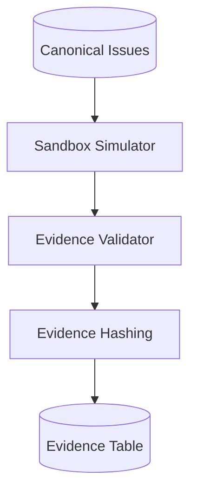

# M5: offline lab validation and evidence

## Goal and boundary

M5 supplies a deterministic validation signal for SQL injection, XSS and SSRF findings without
contacting reported targets. `lab_simulator` compares a controlled scenario fixture with the
finding classification. Its `simulated_match` verdict is supporting triage evidence and never a
claim that a real system is exploitable. Submitted scanner payloads are never executed.

Real Docker execution remains deferred. A `docker` request fails explicitly even if configuration
is enabled. Target hosts must match `SANDBOX_ALLOWLIST`; validation performs no network calls.

## Contracts

- `POST /api/v1/canonical-issues/{id}/validate` accepts mode, optional `sqli|xss|ssrf` scenario,
  optional lab target host, and a test-only timeout switch. Missing issues return 404; disallowed
  targets or Docker mode return 422.
- `GET /api/v1/validations/{id}` returns one immutable run; `/evidence` returns its artifacts.
- Runs record issue/finding, scenario, target, mode, timestamps, timeout, verdict, confidence,
  summary, limitations and artifact IDs. Repeated calls create new IDs.
- Evidence is derived, redacted UTF-8 text. SHA-256 and size cover the exact stored/served bytes.
- Latest `simulated_match`, `simulated_no_match`, and inconclusive outcomes map to validation risk
  factors 0.75, 0.25, and 0.5. No run retains the neutral 0.5 prior.

## Acceptance

All three scenarios persist and round-trip; unknown/timeout are inconclusive; allowlist and Docker
requests fail; secrets are absent; hashes verify; repeated runs remain readable; prioritization
reports the latest simulated verdict and contribution.

## Architecture Diagram

