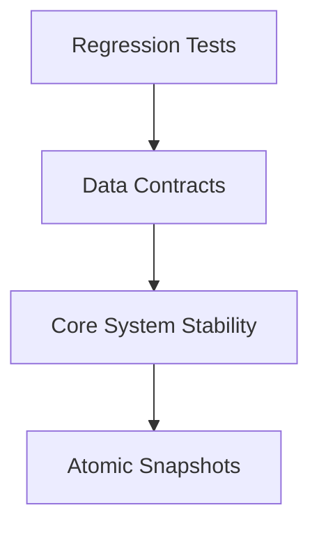

# R0 baseline reliability contract

This extends M0/M2 and supplies the missing dedup/lifecycle contract for R0.

- Python 3.12 with the existing direct dependency pins; tests use one temporary SQLite
  database per test and a deterministic hashing embedder, with outbound networking blocked.
- Both dedup stages partition candidate groups until every pair satisfies explicit asset,
  host, package, and parameter constraints. Unknown fields are not evidence of a mismatch;
  they also cannot bridge two incompatible members. HTTP parameter names are case-sensitive.
- Preserve supplied Nessus URL/path/parameter fields before fingerprinting; they are part of
  the synthetic enriched export contract and must survive normalization for cross-scanner dedup.
- Cluster and issue IDs derive from sorted finding IDs (cluster IDs also include method).
  One active canonical issue represents each finding. Reruns reconcile one atomic snapshot,
  retaining inactive issues and original evidence. Existing databases migrate additively.
- Analyst splits reserve their member findings as singletons on future runs. Explicit merge
  can reverse a split when it passes hard blocks and does not absorb unrelated active issues.
  Analyst-confirmed merges remain fixed during automatic reruns.
- Membership changes retire prior issues, remove their cached priorities, mark dependent cases
  stale without changing human decisions, and append an audit event. Historical validation,
  artifacts, cases and reviews remain accessible. Repeated actions are no-ops.
- Repository transactions use BEGIN IMMEDIATE with nested repository access sharing a connection;
  no network awaits occur inside these transactions. Failure rolls back the entire snapshot.
- Live KEV/EPSS requests are explicitly unsupported. Mock cache entries carry the hash of both
  source files; a changed file invalidates the cache immediately. No missing/malformed feed is
  silently treated as a clean result. Risk output includes feed provenance and all six contributions;
  validation remains an explicitly labeled neutral prior until P6.
- Embedding outputs identify the actual backend/model version and hash input text. Missing views
  replace stale vectors. Incompatible embedding backends are not compared; semantic status and
  backend names are returned in dedup summaries. Model loading is local-only unless opted in.

Acceptance: existing tests plus API startup/ingestion, both-stage hard-block regressions,
semantic bridge, reruns, split/merge, downstream invalidation, rollback/concurrency, additive
migration, mock-file refresh/live rejection, fallback provenance and risk sum tests pass.

## Architecture Diagram

